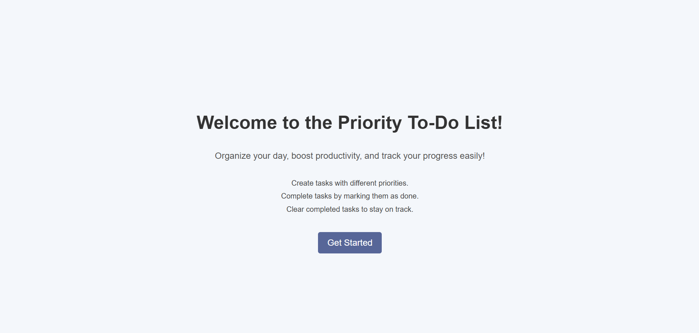
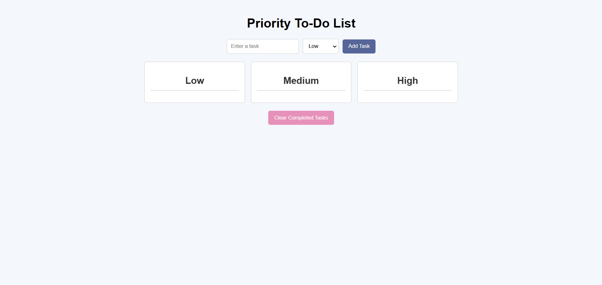
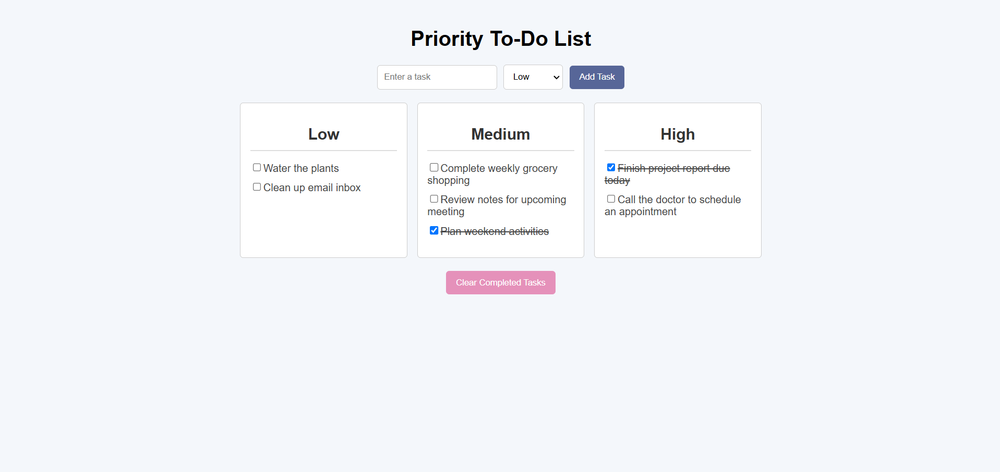

# Task-Tracker

## Description

**Task-Tracker** is an application for managing tasks with priority levels. It helps you organize your day, boost productivity, and track task completion.

### Features:
- Add tasks with different priority levels (Low, Medium, High).
- Mark tasks as completed.
- Remove all completed tasks.
- User-friendly interface with task categorization by priority.
- Welcome screen for new users.

---

## Technologies

- **React** — for building the user interface.
- **CSS** — for styling components.
- **HTML** — for structuring components.

---

## Installation and Launch

1. **Clone the repository:**
   ```bash
   git clone https://github.com/MariannaSh/Task-Tracker.git
   cd task-tracker
2. **Install dependencies:**
    ```bash
    npm install
3. **Run the application:**
   
    ```bash
    npm start
The application will open in your browser at http://localhost:3000.

## How to Use
1. On the welcome screen, click the **"Get Started"** button.
2. Add a task by typing it in and selecting its priority from the dropdown menu.
3. Mark tasks as completed using the checkbox.
4. Clear the list of completed tasks by clicking **"Clear Completed Tasks"**.

## Screenshots
**Welcome Screen:**



**Main Screen:**




## Enjoy Using Task-Tracker!
We hope Task-Tracker becomes your go-to tool for managing tasks and boosting productivity. Whether it's organizing your day or keeping track of important to-dos, this app is here to help. 💗
